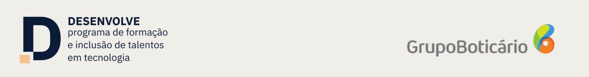

## 👨‍💻 Sobre Mim

Se quiser saber mais sobre mim e minha trajetória profissional, acesse meu site: **[Portfólio Felipe Santos](https://webcvfelipe.vercel.app/home)**

---

## 📚 Sobre o Projeto

Olá! 👋 Este repositório contém todas as minhas anotações, códigos e aprendizados durante o **Programa Desenvolve** do Grupo Boticário! 

Se quiser saber mais sobre mim e minha trajetória profissional, acesse meu site: **[Portfólio Felipe Santos](https://webcvfelipe.vercel.app/home)**

O Desenvolve é uma iniciativa incrível e **100% gratuita** do Grupo Boticário que oferece formação e inclusão de talentos em tecnologia. É uma oportunidade única para impulsionar carreiras na área Tech! 💻✨

### Trilha Escolhida
- **Desenvolvimento de Software** 🖥️

### Sobre o curso
- **Trilha:** Desenvolvimento de Software
- **Início:** 09/06/2025
- **Término:** 09/10/2025
- **Aulas:** Segunda, terça e quarta-feira das 19h às 22h (ao vivo)
- **Total:** 160 horas de curso
- **Mentorias:** Individuais com profissionais do Grupo Boticário

## 🎯 Objetivos do Projeto

Este repositório serve como um **diário de aprendizado** e **portfólio em construção** durante minha jornada no Programa Desenvolve. Aqui você encontrará:

- 📖 **Documentação completa** de cada aula e conceito aprendido
- 💻 **Códigos funcionais** desenvolvidos durante os exercícios práticos
- 🎨 **Projetos reais** criados para aplicar os conhecimentos
- 📝 **Anotações valiosas** sobre boas práticas e dicas dos mentores
- 🚀 **Evolução constante** do meu desenvolvimento como programador

## 🔗 Links Úteis

- [Site Oficial do Desenvolve](https://desenvolve.grupoboticario.com.br/)

### 💖 Agradecimentos

Agradeço ao **Grupo Boticário** e à **Escola Koru** por essa oportunidade incrível de crescimento profissional! 

**Feito com ❤️ durante o Programa Desenvolve 2025** 